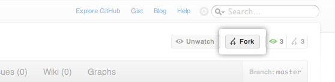

Contributing to StarCluster
===========================
.. note::
    **Prerequisites**: You need to `install git
    <http://help.github.com/set-up-git-redirect>`_ before following these
    instructions. You should also familiarize yourself with the basic use and
    work flow model of git before following these instructions. The folks over
    at github put together a good `introduction to git <http://gitref.org>`_
    that you can use to get started with git.

Overview
--------

Sign-up for a github account
----------------------------
StarCluster's source code is stored on `github.com <https://github.com>`_. It
is preferred that you use github.com to submit patches and enhancements via
`pull requests <http://help.github.com/pull-requests/>`_. The first step is to
sign up for a `github account <https://github.com>`_.

Fork the StarCluster project
----------------------------
Once you have a github account the next step is to `fork
<http://help.github.com/fork-a-repo/>`_ the StarCluster github repository. To
do this you must first login to `github <https://github.com>`_ and then
navigate to the `StarCluster repository
<https://github.com/jtriley/StarCluster>`_. Once there click on the **Fork**
button towards the top right of the project page:

This will create your own copy of the StarCluster repository under your github
account that you can modify and commit to. Having your own copy allows you to
work on bug fixes, docs, new features, etc. without needing special commit
access to the main StarCluster repository.

Setup a virtualenv for StarCluster development
----------------------------------------------
When developing a Python project it's useful to work inside an isolated Python
environment that lives inside your *$HOME* folder.  This helps to avoid
dependency version mismatches between projects and also removes the need to
obtain root privileges to install Python modules/packages for development.

Fortunately there exists a couple of projects that make creating and managing
isolated Python environments quick and easy:

* `virtualenv <http://pypi.python.org/pypi/virtualenv>`_ - Virtual Python
  Environment builder
* `virtualenvwrapper <http://pypi.python.org/pypi/virtualenvwrapper>`_ - Shell
  enhancements for virtualenv

To get started you first need to install and configure virtualenv and
virtualenvwrapper:

.. warning::
    You need *root* access to run the *sudo* commands below.

.. code-block::  ini

    $ sudo easy_install virtualenv
    $ sudo easy_install virtualenvwrapper
    $ mkdir $HOME/.virtualenvs
    $ echo "source /usr/local/bin/virtualenvwrapper.sh" >> $HOME/.bashrc

*If* you're using `zsh <http://www.zsh.org>`_ then the last line should be
changed to:

.. code-block:: ini

    $ echo "source /usr/local/bin/virtualenvwrapper.sh" >> $HOME/.zshrc

Running these commands will install both virtualenv and virtualenvwrapper and
configure virtualenvwrapper to use **$HOME/.virtualenvs** as the top-level
virtual environment directory where all virtual environments are installed.

At this point you will either need to close your current shell and launch a new
shell or *re-source* your shell's *rc* file:

.. code-block:: ini

    $ source $HOME/.bashrc

This will reload your shell's configuration file and configure
virtualenvwrapper. The next step is to create a new virtual environment called
*starcluster* and change into that virtual environment:

.. code-block:: ini

    $ mkvirtualenv --clear --no-site-packages --distribute starcluster
    (starcluster)$ echo $PATH
    /home/user/.virtualenvs/starcluster/bin:/usr/local/bin:/usr/bin:/bin:/opt/bin

Running this command will create a new folder *$HOME/.virtualenvs/starcluster*
containing your new isolated Python environment for StarCluster. This command
will also modify your current shell's environment to work with the StarCluster
virtual environment. As you can see from the *echo $PATH* command above your
PATH environment variable has been modified to include the virtual
environment's *bin* directory at the front of the path. This means when you
type *python* or other Python-related commands (e.g. easy_install, pip, etc.)
you will be using the virtual environment's isolated Python installation.

To see a list of your virtual environments:

.. code-block:: ini

    $ workon
    starcluster

To *activate* (or enter) a virtual environment:

.. code-block:: ini

    $ workon starcluster
    (starcluster)$ cdvirtualenv
    (starcluster)$ pwd
    /home/user/.virtualenvs/starcluster
    (starcluster)$ ls
    bin  build  include  lib  lib64  man  share

To *de-activate* (or leave) a virtual environment:

.. code-block:: ini

    (starcluster)$ deactivate
    $ echo $PATH
    /usr/local/bin:/usr/bin:/bin:/opt/bin

Installing packages within your virtual environment is the same as outside the
virtual environment except you don't need *root* privileges. You can use either
*easy_install* or *pip* to install Python packages/modules. Since IPython_ is
required to use StarCluster's development shell let's install IPython_ now to
test this out:

.. code-block:: ini

    (starcluster)$ pip install ipython

This will install IPython_ within the virtual environment. You can verify this
using the following command:

.. code-block:: ini

    (starcluster)$ which ipython
    /home/user/.virtualenvs/starcluster/bin/ipython

.. _IPython: http://pypi.python.org/pypi/ipython

Clone your fork
---------------
Now that you have a working virtual environment for StarCluster it's time to
check out your fork of StarCluster:

.. note::
    Replace **<user>** in the *git clone* command below with your github username.

.. code-block::  ini

    $ workon starcluster
    (starcluster)$ cdvirtualenv
    (starcluster)$ git clone <user>@github.com:<user>/StarCluster.git starcluster

The *git clone* command above will checkout StarCluster's source files to
$HOME/.virtualenvs/starcluster/starcluster. The next step is to configure
StarCluster's Python source for development. To do this run the following
command:

.. code-block:: ini

    $ workon starcluster
    (starcluster)$ cd $VIRTUAL_ENV/starcluster
    (starcluster)$ python setup.py develop

The *python setup.py develop* command will install StarCluster into the virtual
environment's site-packages in such a way that the sources are *linked* rather
than copied to the site-packages directory.

.. note::

    This has the benefit that as soon as a change is made in the StarCluster
    source files the changes will show up immediately in the virtual
    environment's `site-packages
    <http://docs.python.org/install/index.html#how-installation-works>`_
    directory.  If you were to use *python setup.py install* you would instead
    need to re-install StarCluster each time you made a change for the changes
    to become active in the virtual environment's Python installation.

Code clean-up
-------------
Before committing any code please be sure to run the `check.py
<https://github.com/jtriley/StarCluster/blob/master/check.py>`_ script in the
root of your StarCluster git repository. This script runs `pep8
<http://pypi.python.org/pypi/pep8>`_ and `pyflakes
<http://pypi.python.org/pypi/pyflakes>`_ on all source files and outputs any
errors it finds related to pep8 formatting, syntax, import errors, undefined
variables, etc. Please fix any errors reported before committing.

:pep:`8`

.. code-block:: ini

    $ cd $STARCLUSTER_REPO
    $ pip install pep8
    $ pip install pyflakes
    $ ./check.py
    >>> Running pyflakes...
    >>> Running pep8...
    >>> Clean!

Submit your changes upstream
----------------------------
Once you've finished fixing bugs or adding features you're now ready to `submit
a pull request <http://help.github.com/pull-requests/>`_ so that the changes
can be merged upstream and be included in the next stable release.
