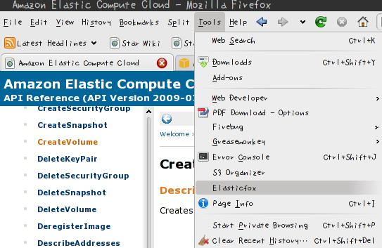
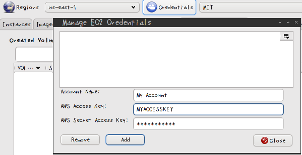
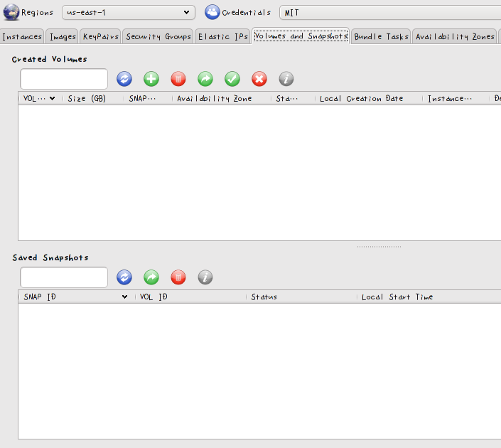
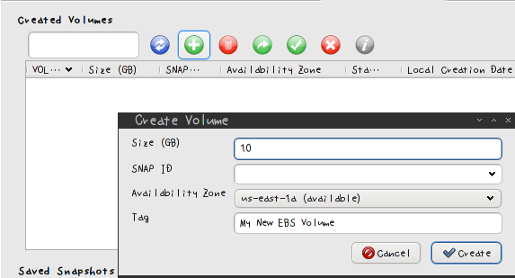
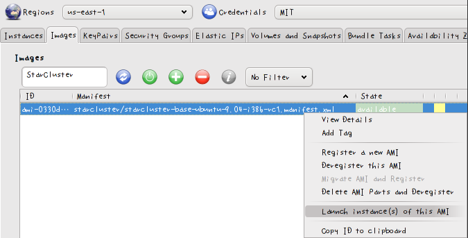
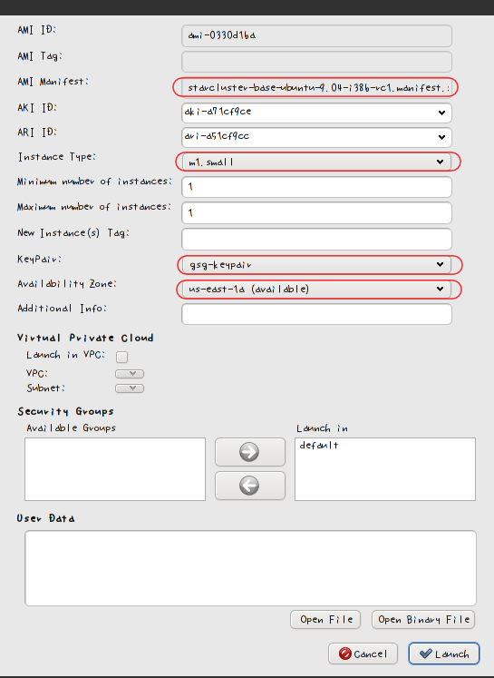
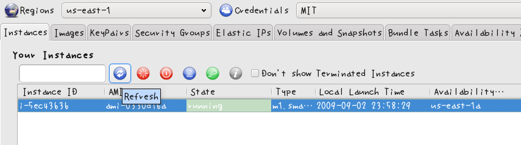
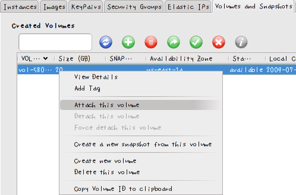
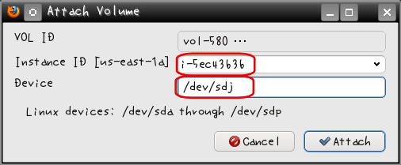
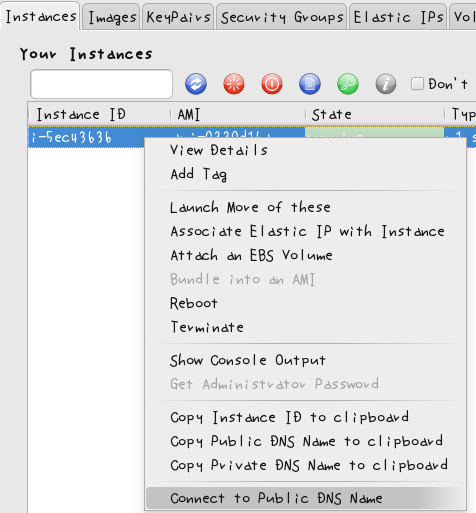

Manually Creating an EBS Volume for Use with StarCluster
========================================================
Initializing a New EBS Volume
-----------------------------
StarCluster has the ability to use an Amazon Elastic Block Storage device for 
persistent storage. This device is attached to the master node of the cluster and
then mounted to *MOUNT_PATH* specified in the config.  The device is then shared 
across the nodes using the network file system (NFS).

To use EBS for persistent storage you must first create a new EBS volume, 
partition the volume, and then format the partitions. Below are instructions 
for creating and formating a new EBS volume for use with StarCluster.

**NOTE:** These instructions only need to be followed the first time you create 
an EBS volume.

Creating a New EBS Volume
-------------------------
For now, these instructions utilize the ElasticFox Firefox plugin to create 
the EBS volume. In the next release, StarCluster will provide a command line 
option for creating and initializing a new EBS volume. Nevertheless, ElasticFox 
is a very useful tool for managing your EC2 instances, images, volumes, etc.

After installing Firefox with the latest ElasticFox addon, follow the steps 
below to create and initialize your EBS volume.

1. Open ElasticFox by first opening Firefox and then going to Tools -> ElasticFox 
in the main menu: 

2. Add your AWS Credentials to ElasticFox by clicking the Credentials button, 
filling in your AWS account info, and pressing the **Add** button. 

3. After you've entered your AWS Credentials in ElasticFox, navigate to the 
*Volumes and Snapshots* tab in ElasticFox.

4. Next we'll add a new Elastic Block Storage volume by clicking the *plus* icon and 
providing the Size, Availability Zone (**remember this!!!**), and optionally any 
Tag (ie description) you want to apply (leave **SNAP ID** blank)

5. Press the Create button to create the volume

Partitioning and Formatting the New Volume
------------------------------------------
The previous steps created a new Elastic Block Storage device. However, this device 
has not yet been partitioned and formatted. To do this, we'll launch a m1.small instance 
in the same availability zone that we created the volume in. We will then attach the EBS 
device to this instance, partition the device with one partition that takes up the entire 
device, and then format that partition using the ext3 filesystem.

1. In ElasticFox switch over to the Images tab, type StarCluster into the search 
box, and right click the 'StarCluster i386' image and select Launch instance(s) 
of this AMI 

2. In the dialog that pops up, make sure to select the same Availability Zone you 
used to create the EBS volume in the previous section. This is needed in order to 
attach the volume to the new instance. Also, be sure to select your AWS keypair.

3. Switch over to the Instances tab and continue to press the refresh tab every 
few minutes or so until the instance is in a running state 

4. Once the instance is running, switch over to the Volumes and Snapshots tab, 
right click your volume, and select Attach Volume

5. In the dialog that pops up, select the instance's id in the instance combo box 
and put /dev/sdj in the device section and press OK. If you don't see your instance 
in the combo list, this is most likely due to your instance not being launched in the 
same availability zone as your EBS volume. 

6. Refresh the Volumes and Snapshots tab every few minutes until the volume is 
attached.

7. Once the volume has been attached to the instance, ssh into the instance using 
your AWS Keypair. This can be done directly using PuTTY or OpenSSH. You can also 
do this through ElasticFox in the Instances tab by right clicking the instance and 
selecting *Connect to Public DNS Name*. This will launch a terminal and attempt to 
login to the instance as root via SSH: 

8. After logging into the server as root, run the following command to 
automatically partition the volume with one Linux partition (/dev/sdj1) that takes
up the entire volume:

.. code-block:: none

        echo ",,L" | sfdisk /dev/sdj

The output should be similar to:

.. code-block:: none

        $ echo ",,L" | sfdisk /dev/sdj
        Checking that no-one is using this disk right now ...
        OK

        Disk /dev/sdj: 1014 cylinders, 62 heads, 62 sectors/track
        Old situation:
        Units = cylinders of 1968128 bytes, blocks of 1024 bytes, counting from 0
        ...
        ...

9. Next, format /dev/sdj1 with the ext3 filesystem by running the following 
command as root:

.. code-block:: none

        mkfs.ext3 /dev/sdj1

The output should be similar to:

.. code-block:: none

        $ mkfs.ext3 /dev/sdj1
        mke2fs 1.41.3 (12-Oct-2008)
        Filesystem label=
        OS type: Linux
        Block size=4096 (log=2)
        Fragment size=4096 (log=2)
        121920 inodes, 487226 blocks
        24361 blocks (5.00%) reserved for the super user
        First data block=0
        Maximum filesystem blocks=499122176
        15 block groups
        32768 blocks per group, 32768 fragments per group
        8128 inodes per group
        Superblock backups stored on blocks:
        32768, 98304, 163840, 229376, 294912

        Writing inode tables: done
        Creating journal (8192 blocks): done
        Writing superblocks and filesystem accounting information: done

        This filesystem will be automatically checked every 27 mounts or
        180 days, whichever comes first. Use tune2fs -c or -i to override.

10. Congratulations!!! You've now successfully initialized your EBS volume. Be 
sure to enable the EBS settings in the StarCluster configuration file in order 
to use your new EBS volume.
