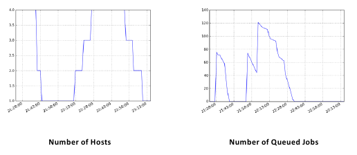
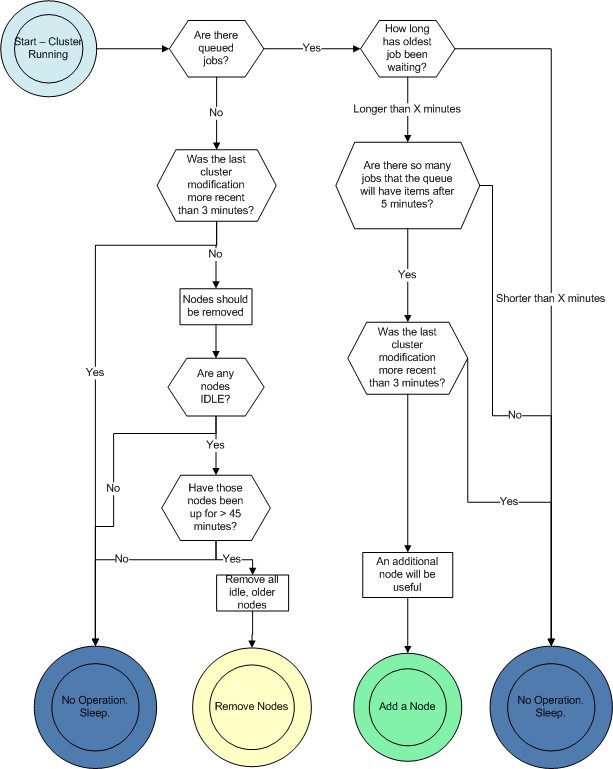

#################################
StarCluster Elastic Load Balancer
#################################
StarCluster's load balancer grows and shrinks an Oracle Grid Engine cluster
according to the length of the cluster's job queue. When the cluster is heavily
loaded and processing a long job queue, the load balancer can gradually add
more nodes, up to the specified max_nodes, to distribute the work and improve
throughput. When the queue becomes empty, the load balancer can remove idle
nodes in order to save money. The cluster will shrink down to a single node,
the master, terminating all of the other nodes as they become idle.

*****
Goals
*****

* To increase the size of the cluster to some user-defined maximum number of
  nodes when there is a large queue of waiting jobs
* To decrease the size of the cluster to a single node or some minimum number
  of nodes when there are no jobs waiting to optimize for cost
* To elastically balance the cluster's load deterministically, predictably, and
  slowly.

*****
Usage
*****
You must already have a cluster running in order to use StarCluster's load
balancer. Once you have a cluster running you can load balance the cluster by
passing the name of the cluster to the *loadbalance* command::

    $ starcluster loadbalance mycluster

This will start the load balancer in an infinite loop running on your local
machine. The load balancer will continuously monitor the cluster's Oracle Grid
Engine queue and determine whether it should add or remove nodes to the cluster
or not. A running load balancer session can be safely stopped at any time by
pressing CTRL-C. A new load balancing session can be resumed later simply by
re-executing the above command.

Cluster Size Limits
===================
If a cluster that's being load balanced experiences a heavy load for a
sustained amount of time, the load balancer will begin adding nodes
continuously in order to reduce the load. Once the cluster size has reached an
upper-bound limit the load balancer will stop adding new nodes even if it
thinks another node should be added. Conversely, if the cluster is idle for a
prolonged amount of time the load balancer will begin removing nodes to reduce
costs. Once the cluster size has reached a lower-bound limit the load balancer
will stop removing nodes.

By default, the upper-bound, is set to the original **CLUSTER_SIZE** used when
creating the cluster and the lower-bound is set to one. This means that the
number of nodes in the cluster will fluctuate, by default, between 1 and
**CLUSTER_SIZE** as necessary to optimize for cost and performance.

You can change the upper-bound limit, or maximum number of nodes, using the
*-m* or *--max_nodes* option::

    $ starcluster loadbalance -m 20 mycluster

The above command tells the load balancer to increase the size of the cluster
as necessary up until there are twenty nodes in the cluster.

You can also change the lower-bound limit, or minimum number of nodes, using
the *-n* or *--min_nodes* option::

    $ starcluster loadbalance -n 3 mycluster

The above command tells the load balancer to decrease the size of the cluster
as necessary until there are three nodes in the cluster.

Increasing Cluster Growth Rate
==============================
By default the load balancer will add a single node at a time when adding new
nodes to the cluster. This allows the load balancer to gradually make a change
and observe the impact on the queue without adding excessive resources.
However, if you'd like to increase the number of nodes added when the load
balancer determines more nodes are necessary use the *-a*, or
*--add_nodes_per_iter*, option::

    $ starcluster loadbalance -m 20 -a 2 mycluster

The above command will load balance *mycluster* up to a maximum of twenty nodes
by adding two nodes at a time as necessary.

Load Balancer Statistics
========================
The *loadbalance* command supports outputting various load balancing stats over
time such as the number of nodes, number of running jobs, number of queued
jobs, etc. while it's running:

To plot these stats over time in *png* format::

    $ starcluster loadbalance -p mycluster

By default, this will generate the plots as *png* images in
$HOME/.starcluster/sge/<cluster_tag>/. You can change where the load balancer
outputs the images using the *-P* option::

    $ starcluster loadbalance -p -P /path/to/stats/imgs/dir mycluster

You can also dump the raw stats used to build the above plots into a single csv
file::

    $ starcluster loadbalance -d mycluster

The above command will run the load balancer and output stats to a csv file. By
default the stats are written to
$HOME/.starcluster/sge/<cluster_tag>/sge-stats.csv, however, this can be
changed using the *-D* option::

    $ starcluster loadbalance -d -D /path/to/statsfile.csv mycluster

You can of course combine all of these options to generate both the plots and
the raw statistics::

    $ starcluster loadbalance -d -p mycluster

Advanced Configuration
======================
The following parameters are also available for fine-tuning, however, the
majority of users shouldn't need them:

#. **Polling interval** (-i INTERVAL or --interval=INTERVAL) - How often, in
   seconds, to collect statistics and make decisions
#. **Wait Time** (-w WAIT_TIME, --job_wait_time=WAIT_TIME) - Maximum wait time,
   in seconds, for a job before adding nodes
#. **Kill after** (-k KILL_AFTER, --kill_after=KILL_AFTER) - Minutes after
   which a node can be killed
#. **Stabilization time** (-s STAB, --stabilization_time=STAB) - How long, in
   seconds, to wait before cluster "stabilizes"
#. **Lookback window** (-l LOOKBACK_WIN, --lookback_window=LOOKBACK_WIN) - How
   long, in minutes, to look back for past job history

Experimental Features
=====================
The load balancer, by default, will not kill the master node in order to keep
the cluster alive and functional. However, there are times when you might want
to destroy the master if the cluster is completely idle and there are no more
nodes left to remove. For example, you may wish to launch 10000 jobs and have
the cluster shutdown when the last job has completed. In this case you can use
the experimental *-K*, or *--kill-master*, option::

    $ starcluster loadbalance --kill-master mycluster

The above command will load balance *mycluster* as usual, however, once all
jobs have completed and all worker nodes have been shutdown by the load
balancer the master node will also be terminated.

************
How it Works
************
There is a polling loop that runs every 60 seconds by default. The polling loop
interval can be tuned using the *-i* configuration option discussed in the
previous section. Every polling interval the load balancer will connect to the
cluster, obtain statistics from Oracle Grid Engine, and decide whether or not
to add or remove nodes based on the current job queue. The load balancer only
deals only with the queue length and active machines. Currently the load
balancer only supports monitoring the *default* queue, "all.q". Future releases
will support balancing arbitrary once `pull request 20`_ has been merged.

The diagram below illustrates the decisions that the load balancer will make in
each loop:

Criteria for Adding a Node
==========================
A node will be added when *all* of the following criteria have been met:

#. There are jobs in the queued waiting (SGE's moniker is 'qw') state
#. The longest queued job has been waiting for more than 15 minutes
#. The number of nodes does not meet or exceed the maximum number of nodes set
   in the configuration file.

A user can set the number of nodes to be added per iteration. For instance, if
the user wanted to add 1 node per iteration, which is standard and a
recommended practice, they would set the *--add_nodes_per_iteration* parameter
to one. If the user wanted two nodes to be added per iteration, that parameter
should be set to two, and the cluster would grow at a faster rate, consequently
incurring higher charges from Amazon.com.

Criteria for Removing a Node
============================
A node will be removed when *all* of the following criteria have been met:

#. No jobs are in the queued waiting ('qw' state) state
#. The node in question is idle, meaning it is not running an SGE job
#. The node in question is not the master node
#. The node in question has been up for more than 45 minutes past the hour.

Each node in the cluster will be analyzed in turn, and any and all nodes
meeting the above criteria will be terminated in that polling loop. The entire
cluster need not be idle for a node to be terminated: If Node001 is working on
a job, but Node002 is idle and there are no queued waiting jobs, Node002 is a
candidate for termination.

The 45 Minutes Past the Hour Rule
=================================
Since Amazon charges by the hour, we are assuming that you have already paid
for a full hour of server time. It would be wasteful to turn it off the moment
it becomes idle. By keeping that node up for 45 minutes, we allow for it to
complete the maximum workload from the queue, and use 75% of the hour you have
already paid for.

Leaving a node up for this amount of time also increases the stability of the
cluster. It is detrimental to the cluster and wasteful to be continuously adding
and removing nodes.

The Process of Adding a Node
============================
Adding a new node is a multi-stage process:

#. Use the cluster class to start up a new node of the same instance and AMI as
   the other slave nodes in the cluster.
#. Wait for that node to come up. Name it with the highest Node # available: If
   Node001, Node003, and Node005, are started, the next node will be Node006.
#. Set up an /etc/hosts file on each node in the cluster, mapping the new node
   name to its ip address.
#. Create a cluster user account and cluster group on the new node.
#. Set up the /etc/exports file, creating the NFS shares for /home and sge on
   the master, and then exportfs so the shares are open to the slave nodes.
#. Mount the NFS shares on the new node.
#. Configure SGE: inform the master of the new host's address, and inform the
   new host of the master, and execute the sge commands to establish
   communications.

The Process of Removing a Node
==============================
Removing a node is also a multi-stage process:

#. Remove the node from SGE, so that no jobs can be sent to the node while it
   is in a transition period.
#. Remove the node from the /etc/hosts file on other cluster machines.
#. Remove the master's nfs export to this soon-to-be-killed node. Call exportfs
   to cut it off.
#. Terminate the node

Given that the node is immediately removed from SGE, and it seems like SGE
takes about 15 seconds between a qsub command and a node beginning execution of
a job, makes it very unlikely that a job will be started on a host as it is
going down. There is a very small window of time within which this could
happen.

Learning More
=============
To learn more about the design and development of the load balancer please see
`Rajat Banerjee's master's thesis`_.

.. _pull request 20: https://github.com/jtriley/StarCluster/pull/20
.. _Rajat Banerjee's master's thesis: http://www.hindoogle.com/thesis/BanerjeeR_Thesis0316.pdf
