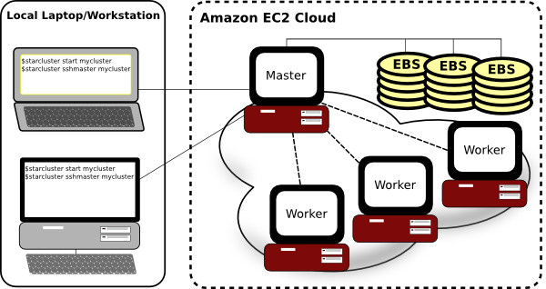
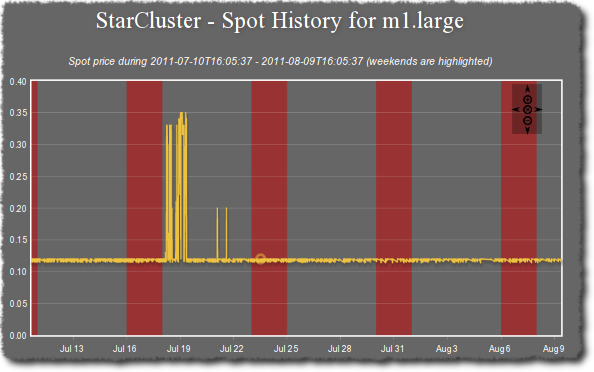

####################
What is StarCluster?
####################
StarCluster is an open source cluster-computing toolkit for Amazon's Elastic
Compute Cloud (EC2). StarCluster has been designed to simplify the process of
building, configuring, and managing clusters of virtual machines on Amazon's
EC2 cloud.

The following sections provide a brief overview of StarCluster's feature set.
For more details, please refer to the :ref:`starcluster-user-manual`.

*********************
Cluster Configuration
*********************
StarCluster takes care of the heavy lifting when it comes to creating and
configuring a cluster on EC2. StarCluster configures the following items
out-of-the-box:

Security Groups
===============
StarCluster configures a new security group for each cluster created (e.g.
*@sc-mycluster*). This allows you to control all network access to the cluster
simply by applying various firewall rules to the cluster's security group.
These rules can be applied using the `Amazon Web Console`_ or by StarCluster
via the :ref:`permissions configuration options <config_permissions>`

User-friendly Hostnames
=======================
StarCluster uses a simple naming convention for all of the nodes in the
cluster. The head node's hostname is set to *master*. Each worker node is then
labeled *node001*, *node002*, etc. StarCluster uses these user-friendly
hostnames instead of the random *ec2-123-123-123.compute-aws.com* EC2 dns names
making it easier for you to manage the nodes::

    $ starcluster listclusters
    StarCluster - (http://web.mit.edu/starcluster)
    Software Tools for Academics and Researchers (STAR)
    Please submit bug reports to starcluster@mit.edu

    ---------------------------------------------
    mycluster (security group: @sc-mycluster)
    ---------------------------------------------
    Launch time: 2011-10-12 17:37:33
    Uptime: 4 days, 08:01:15
    Zone: us-east-1c
    Keypair: myec2key
    EBS volumes:
        vol-7777777 on master:/dev/sdz (status: attached)
    Cluster nodes:
         master running i-99999999 ec2-123-123-123-123.compute-1.amazonaws.com
        node001 running i-88888888 ec2-123-123-123-132.compute-1.amazonaws.com
        node002 running i-77777777 ec2-123-123-123-148.compute-1.amazonaws.com
    Total nodes: 3

User Accounts
=============
By default StarCluster configures a non-root user account for you to use for
non administrative tasks that don't require root privileges::

    $ starcluster sshmaster -u sgeadmin mycluster

Password-less SSH
=================
StarCluster configures the cluster so that ssh may be used from any node in the
cluster to connect to any other node in the cluster *without using a password*.
This means you can simply login to the master node of a cluster::

    $ starcluster sshmaster mycluster

and connect to any of the nodes (e.g. node001, node002, etc.) simply by
running::

    $ ssh node001

This is useful for both interactive use of the cluster as well as performing
various administrative tasks across the cluster. Password-less SSH is also a
strict requirement for MPI applications.

NFS Shares
==========
By default, StarCluster configures */home* on the master node to be NFS-shared
across the cluster. Any EBS volumes specified in a cluster's configuration will
also be NFS-shared across the cluster.

EBS Volumes
===========
StarCluster allows you to easily attach and NFS-share EBS volumes across the
cluster for persistent storage. This can be done in a few lines in the config::

    [volume mydata]
    volume_id = vol-9999999
    mount_path = /mydata

    [cluster mycluster]
    ...
    volumes = mydata

Scratch Space
=============
Each node in the cluster is configured with a /scratch directory linked to its
ephemeral storage (usually mounted on */mnt*). This scratch space provides a
convenient location for temporary working files. As the name *ephemeral*
implies, the contents of /scratch on each node will be lost when a cluster is
terminated.

Queueing System
===============
StarCluster configures the Oracle Grid Engine queueing system for distributing
tasks, or *jobs*, across the cluster. Oracle Grid Engine takes care to schedule
the tasks so that the entire cluster is fully utilized but not overloaded.

*******************************
Customize Cluster Using Plugins
*******************************
StarCluster also has support for plugins which allow users to further configure
the cluster to their liking after StarCluster's defaults. Plugins are written
in Python and use StarCluster's API to interact with the nodes. The API
supports executing commands, copying files, and other OS-level operations on
the nodes. Below is a simple example of a plugin that installs a Debian/Ubuntu
package on all of the nodes:

.. code-block:: python

    from starcluster.clustersetup import ClusterSetup

    class PackageInstaller(ClusterSetup):
         """
         Installs a Debian/Ubuntu package on all nodes in the cluster
         """
         def __init__(self, pkg_to_install):
              self.pkg_to_install = pkg_to_install

         def run(self, nodes, master, user, user_shell, volumes):
              for node in nodes:
                   node.ssh.execute('apt-get -y install %s' % self.pkg_to_install)

For more details see :ref:`the plugin guide <plugin_system>`.

*********************************
StarCluster Machine Images (AMIs)
*********************************
In addition to automatic cluster configuration, StarCluster also ships with
it’s own Amazon machine images (AMIs) that contain applications and libraries
for scientific computing and software development. The AMIs currently consist
of the following scientific libraries:

#. `OpenMPI`_ - Library for writing parallel applications
#. `ATLAS`_ optimized for the larger Amazon EC2 instance types
#. `NumPy/SciPy`_ compiled against the optimized ATLAS install
#. `IPython`_ - interactive parallel computing in Python

StarCluster AMIs also exist for the Cluster Compute and Cluster GPU instance
types that come with the `CUDA SDK`_ as well as `PyCUDA`_. To get a list of all
of StarCluster's available AMIs use the *listpublic* command::

    $ starcluster listpublic

**************************
Create and Manage Clusters
**************************
StarCluster allows easily creating one or more clusters of virtual machines in
the cloud::

    $ starcluster start -s 10 mycluster

Use the *listclusters* command to keep track of your clusters::

    $ starcluster listclusters

Login to the master node of your cluster::

    $ starcluster sshmaster mycluster

Add additional nodes to your cluster for more compute power::

    $ starcluster addnode mycluster

Remove idle nodes from your cluster to minimize costs::

    $ starcluster removenode mycluster node003

When you're done using the cluster and wish to stop paying for it::

    $ starcluster terminate mycluster

***************************
Dynamically Resize Clusters
***************************
StarCluster also supports dynamically adding and removing nodes to and from the
cluster using the Oracle Grid Engine load balancer::

    $ starcluster loadbalance mycluster

The load balancer will continuously monitor the tasks in the Oracle Grid Engine
queue. If the task queue becomes overloaded the load balancer will add more
nodes to relieve the load. If the task queue becomes empty the load balancer
will begin removing nodes from the cluster in favor of cutting costs.

************************************
Easily Create and Format EBS Volumes
************************************
Usually when creating a new EBS volume by hand you would need to create a new
volume, launch an instance in the volume's zone, attach the volume to the
instance, login to the instance, and format the volume. StarCluster does all
that for you automatically in one convenient command::

    $ starcluster createvolume 50 us-east-1c

****************************
Easily Build S3 and EBS AMIs
****************************
There are a lot of tedious steps involved when creating a new S3, or
instance-store, AMI by hand. Similarly, converting an S3-based AMI to an
EBS-based AMI can also be tedious and time consuming. Fortunately, StarCluster
provides two commands, *s3image* and *ebsimage*, that greatly simplify the
process of creating new S3 and EBS AMIs.

To create a new AMI simply launch an instance, customize it to your liking, and
use either the *s3image* command::

    $ starcluster s3image i-99999999 my-new-image my-s3-bucket

or *ebsimage* comand::

    $ starcluster ebsimage i-99999999 my-new-image

to create a new AMI.

*******************************
Copy Data To and From a Cluster
*******************************
StarCluster allows you to easily copy data to and from a running cluster
without having to look up hostnames or figure out OpenSSH's *scp* command, SSH
keys, etc. To copy files from your local computer to a remote cluster::

    $ starcluster put mycluster /local/file/or/dir /remote/path

To copy files from a remote cluster to your local computer::

    $ starcluster get mycluster /remote/path /local/file/or/dir

The above commands will automatically handle recursion for you in the case that
you're copying a directory.

*********************************
Reduce Costs using Spot Instances
*********************************
StarCluster also has support for launching and using spot instances. Using spot
instances with StarCluster is as simple as specifying a spot bid to the *start*
command::

    $ starcluster start -b 0.50 mycluster

The above command will request spot instances with a bid of $0.50 each for each
worker node in the cluster. The master node is *always* launched as a flat-rate
instance for stability reasons.

You can determine a decent spot bid to use by investigating the current,
maximum, and average spot price using the *spothistory* command::

    % starcluster spothistory -p m1.large
    StarCluster - (http://web.mit.edu/starcluster) (v. 0.92)
    Software Tools for Academics and Researchers (STAR)
    Please submit bug reports to starcluster@mit.edu

    >>> Current price: $0.12
    >>> Max price: $0.35
    >>> Average price: $0.13

The above command shows the current spot price as well as the average and
maximum spot price over the last 30 days. The -p option launches a web browser
displaying an interactive graph of the spot price over the last 30 days:

***********
And more...
***********
StarCluster has a lot of features. For all the details, please see the full
:ref:`starcluster-user-manual`.

.. _OpenMPI: http://www.open-mpi.org
.. _ATLAS: http://math-atlas.sourceforge.net
.. _Numpy/Scipy: http://www.scipy.org
.. _IPython: http://www.ipython.org
.. _PyCUDA: http://mathema.tician.de/software/pycuda
.. _CUDA SDK: http://developer.nvidia.com/cuda-downloads
.. _Amazon Web Console: http://aws.amazon.com/console
